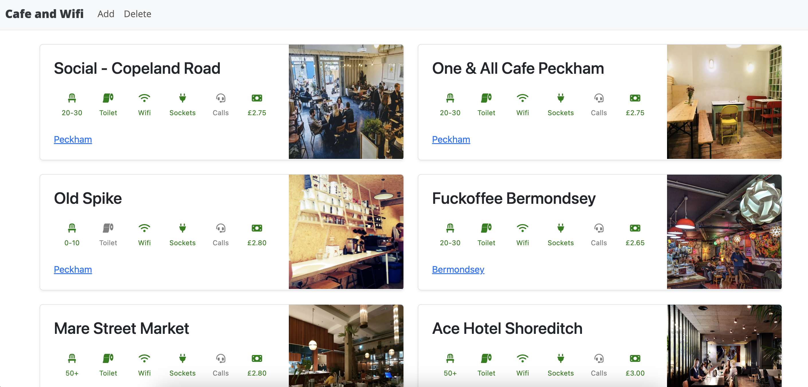
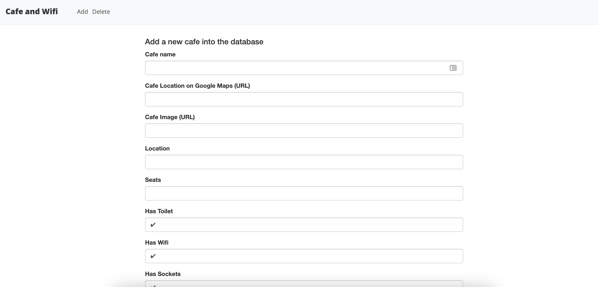
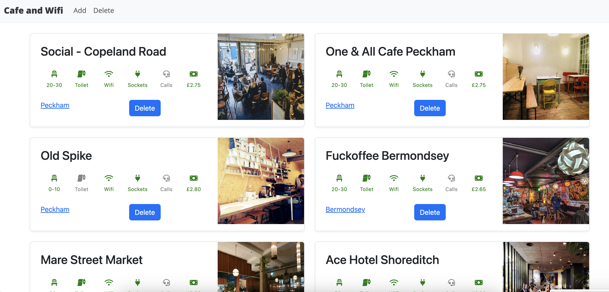

# Cafe Tracker

Cafe Tracker is a web application that allows you to track cafes and their amenities. You can add new cafes, view the existing cafes, and delete cafes from the database. It provides a user-friendly interface to manage and explore different cafes in your area.





## Features

- **View Cafes**: Browse through the list of existing cafes with details including name, location, amenities, and coffee price.
- **Add Cafe**: Add a new cafe to the database by providing information such as cafe name, location, seating capacity, amenities, and coffee price.
- **Delete Cafe**: Remove a cafe from the database if it's no longer relevant or available.

## Installation

1. Clone the repository:

   ```bash
   git clone https://github.com/your-username/cafe-tracker.git
   ```

2. Install the required dependencies:

   ```bash
   pip install -r requirements.txt
   ```

3. Set up the database:

   - Open the `main.py` file.
   - Modify the `app.config["SQLALCHEMY_DATABASE_URI"]` parameter to connect to your preferred database (e.g., SQLite, MySQL, PostgreSQL).
   - Save the changes.

4. Run the application:

   ```bash
   python main.py
   ```

5. Access the application in your web browser:

   ```plaintext
   http://localhost:5000/
   ```
